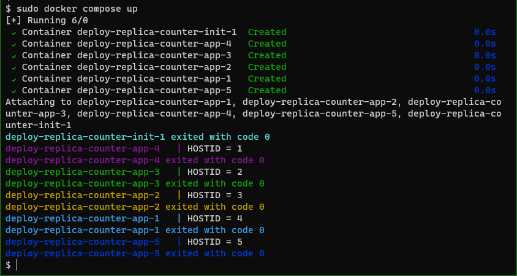

This docker compose file is an example of how to provide an environment variable inside of the container containing the index of the replica.

Docker Compose does not provide such a useful means. So you have to provide one by yourself.

Here is a screenshot of the result of the command `docker compose up`:

